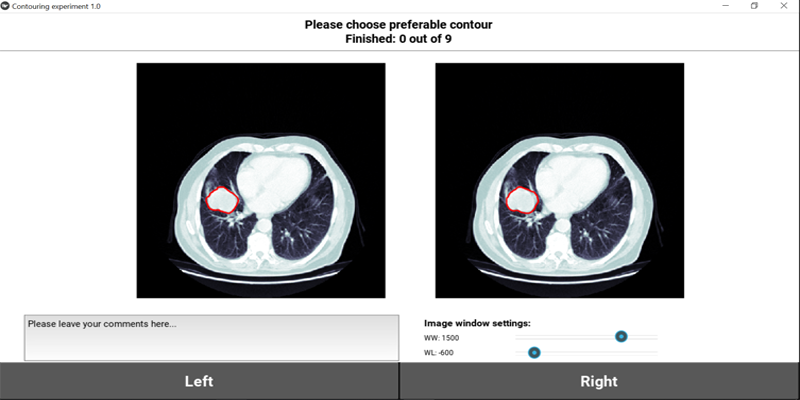

Thank you for agreeing to participate in this experiment!
=========================================================

**Experiment description:**

We are going to show you two images per screen: One segmented manually by doctors and another one segmented automatically by the software. We would like you to indicate which contour is, according to you, the most accurate.

For example, a contour encompassing some normal tissues around the tumour should be seen as inaccurate, same for a contour missing part of the tumour. It could be that you will find that both contours are not correct. In that case, we would like you to indicate the less bad one. We do not ask you to evaluate the "cosmetic" of the contour. Some contours can look unusual but it doesn't mean that they are not accurate.

If you want to add comments please write it in the dedicated window see Fig1.

For the record, we would like to register your **name** and **e-mail** 
( in case we want you to redo the test to look at the reproducibility of your evaluation or if we would like to include you as a co-author or put your name in acknowledgments).

.. note::

	It is OK if you prefer to stay anonymous.

To make further subanalysis we also would like you to specify your training: **Medical Doctor, Radiologist, Radiation Oncologist, Computer Scientist, Student, Other**.

In order to increase contrast of specific tissues during the experiment you can vary image window parameters Window Width (WW) and Window Level (WL) in the Image window settings see Fig 1.

Figure 1. Experiment window

